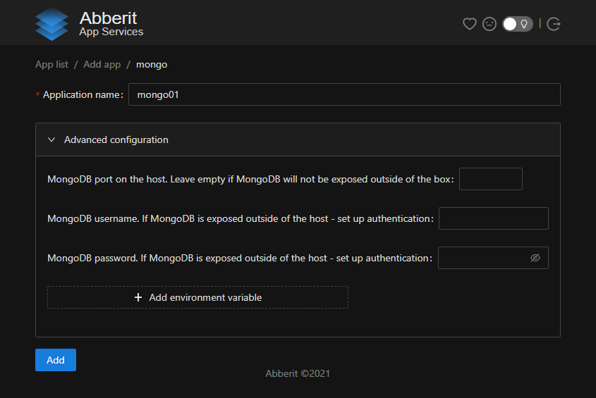

# MongoDB setup

1. [Install](index.md) Abberit panel if not already installed
2. Navigate to Abberit admin panel: `http://<your vm ip>:8081/`
3. Click `Add new App` 
4. Choose `MongoDB` from the supplied list 
5. Fill in the unique application name. This name will be used for identification of your database.
6. Modifications to other fields in `Advanced configuration` section are **optional**, and can be done as follows:
    * `MongoDB port on the host` - set if you would like access MongoDB outside of your server or cluster
    * `MongoDB username` - if MongoDB is shared outside of your server or cluster, we recommend to set the username (applied to MongoDB as `MONGO_INITDB_ROOT_USERNAME`)
    * `MongoDB password` - if MongoDB is shared outside of your server or cluster, we recommend to set the password (applied to MongoDB as `MONGO_INITDB_ROOT_PASSWORD`)
    
7. Make sure you accept terms of the [license for self-hosting MongoDB](https://www.mongodb.com/community/licensing){target=_blank} on your server.
8. Click `Add` to create the MongoDB database.

## Next steps

1. [Manage MongoDB](app-manage-mongodb.md)
