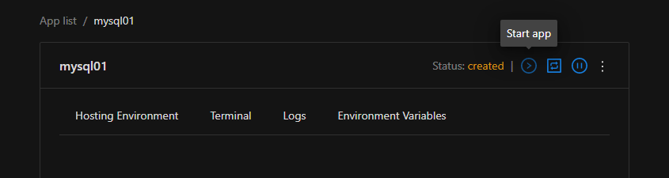

# MySQL setup

1. [Install](index.md) Abberit panel if not already installed
2. Navigate to Abberit admin panel: `http://<your vm ip>:8081/`
3. Click `Add new App` 
4. Choose `MySQL` from the supplied list 
5. Fill in the unique application name. This name will be used for identification of your database.
6. Modifications to other fields in `Advanced configuration` section are **optional**, and can be done as follows:
    * `MySQL port on the host` - set if you would like access MySQL outside of your server or cluster
    * `Use empty password` - keep checked, until you set password to your MySQL database
    * `Add environment variable` - click on this button to add environment variables to database server
    
7. Click `Add` to create MySQL database.
8. After being redirected to `App details` view: click `Run app` button in top right corner:

## Next steps

1. [Manage MySQL](app-manage-mysql.md)
