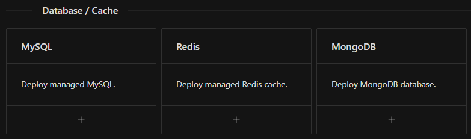
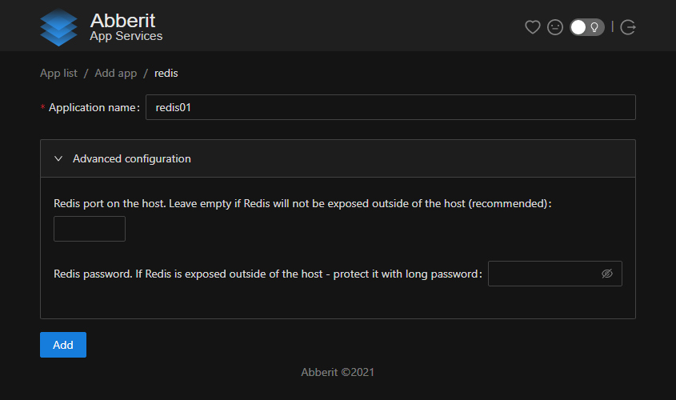

# Redis setup

1. [Install](index.md) Abberit panel if not already installed
2. Navigate to Abberit admin panel: `http://<your vm ip>:8081/`
3. Click `Add new App` 
4. Choose `Redis` from the supplied list 
5. Fill in the unique application name. This name will be used for identification of your database.
6. Modifications to other fields in `Advanced configuration` section are **optional**, and can be done as follows:
    * `Redis port on the host` - set if you would like access Redis outside of your server or cluster
    * `Redis password` - if Redis is shared outside of your server or cluster, we recommend to set the password (applied to Redis as command line argument `--requirepass`)
    
7. Click `Add` to create the Node.js app.

## Next steps

1. [Manage Redis](app-manage-redis.md)
