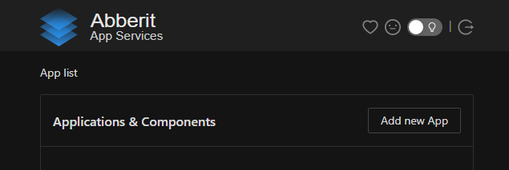

# WordPress setup

1. [Install](index.md) Abberit panel if not already installed
2. Navigate to Abberit admin panel: `http://<your vm ip>:8081/`
3. Click `Add new App` 
4. Choose `WordPress™` from the supplied list 
5. Fill in the unique application name. This name will be used only for identification of your application, and won't affect how users access your website.
6. Modifications to other fields are **optional**, and can be done as follows:
    * `Domain name` - use it if multiple apps are hosted on the same name, but using different domain names. Refer to [Setting up domain](app-domain.md) for detailed instructions
    * `Application port` - change if you would like to change the port the application is available on. By default port `80` is configured, which is common for http:// protocol
    * `Advanced configuration` allows to set up https:// website and SSL certificate. Refer to [Configure webapp for https](app-https.md) section for detailed instructions
    
    * `Create new mysql instance` - mysql database is required by wordpress, leave the toggle on, if you'd like to create a new mysql instance for new wordpress app
    * `New MySQL instance name` - the unique app name for the new mysql instance
    * `MySQL app name to connect to` - specify mysql instance app name if you'd like to re-use existing instance
    * `Start wordpress app after create` - leave toggle on if you'd like to see the newly created app be automatically started after creation
6. Click `Add` to create the WordPress website.

## Next steps
1. [Configure domain name for your application](app-domain.md)
2. [Configure https:// access to your website](app-https.md)

## Additional Guides:
1. [:material-launch: SSL certificate guides](https://www.linode.com/docs/guides/security/ssl/){target=_blank}
2. [:material-launch: Installing certbot](https://www.linode.com/docs/guides/how-to-install-certbot-on-ubuntu-18-04/){target=_blank}