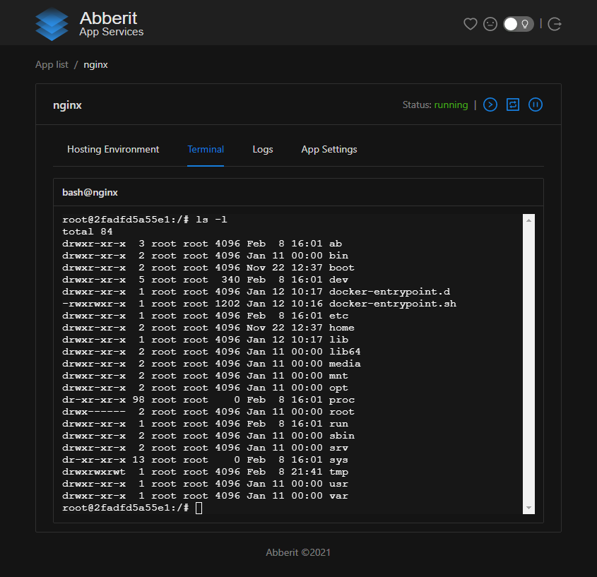

# Application telemetry

To diagnose common startup and runtime issues use application logs, metrics and terminal.

## Application Metrics

Application Metrics give overall picture on resource usage in realtime. For each application Abberit Admin Panel provides the information on CPU, memory and network usage.

## Application Logs

To access Application Logs - click on `logs` link on application card on `App list` view or click on `Logs` tab on `App Details` view.

## Application Terminal

For most advanced troubleshooting and configuration tasks - access Application Terminal. For that on `App Details` view click on `Terminal` tab. The application must be running for the terminal to work.
