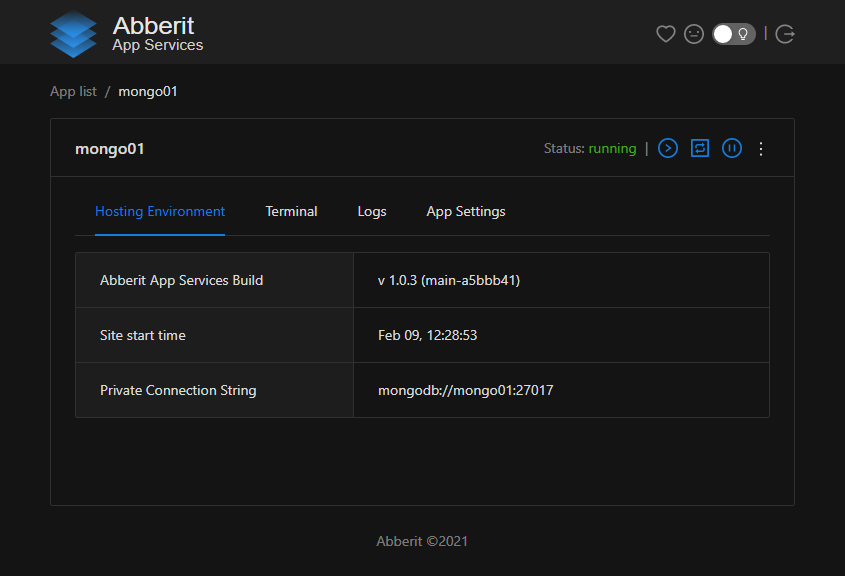
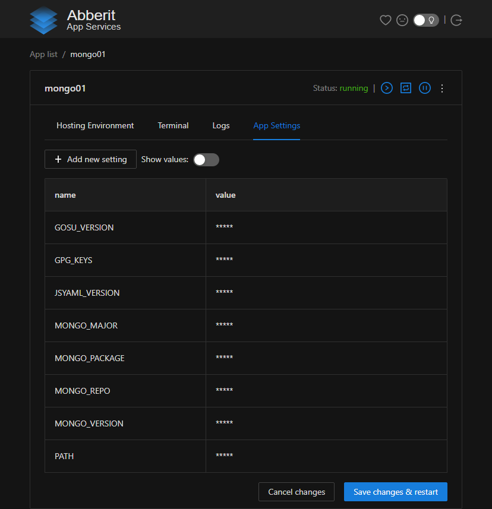
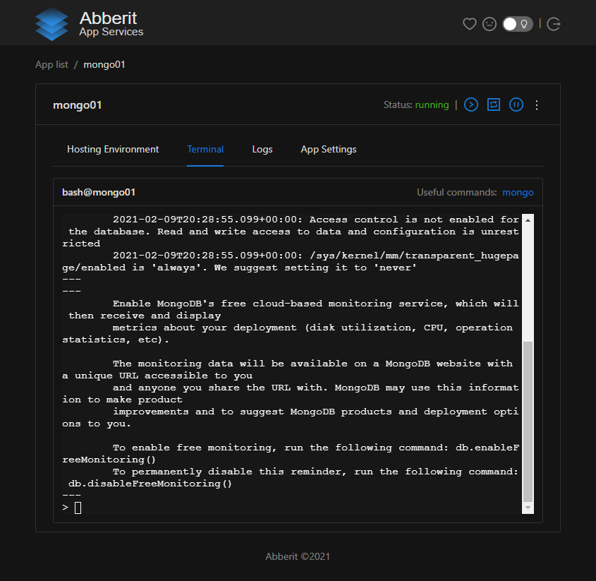

# Manage MongoDB

Abberit Admin Panel provide experiences which allow you to manage MongoDB.

`Hosting Environment` provides the information such as `Private Connection String` and `Public Connection String`.

`App Settings` allows to add and change database environment variables, for example: `MONGO_INITDB_ROOT_USERNAME` and `MONGO_INITDB_ROOT_PASSWORD`.
 
`Terminal` provides an access to Mongo Shell and allows to do sophisticate maintenance and configuration tasks.

## Hosting Environment
`Hosting Environment` can be access by clicking on `Hosting Environment` tab on `App details` view.

It provides `Private Connection String`, which is recommended to be used for secure access by the applications running on the same server or cluster.

When public port was configured to access MongoDB outside of the server or cluster - then `Public Connection String` will be shared as well. That is strongly recommended to protect your database with username and password in that case and rotate them regularly.

## App Settings

`App Settings` can be accessed by clicking on `settings` link on `App list` view on the application card or by clicking on `App Settings` tab in `App details` view.

This tab allows to manage environment variables which define the behavior of MongoDB database.

## Terminal

`Terminal` can be accessed by clicking on `Terminal` tab in `App Details` view. It is `bash` terminal to OS hosting your Node.js application. From it you can accesss `mongo` and other MongoDB and Ubuntu utilities.

## Additional Guides:
1. [Mongo Shell](https://docs.mongodb.com/manual/mongo/){target=_blank}
2. [MongoDB backups](https://docs.mongodb.com/manual/core/backups/){target=_blank}
