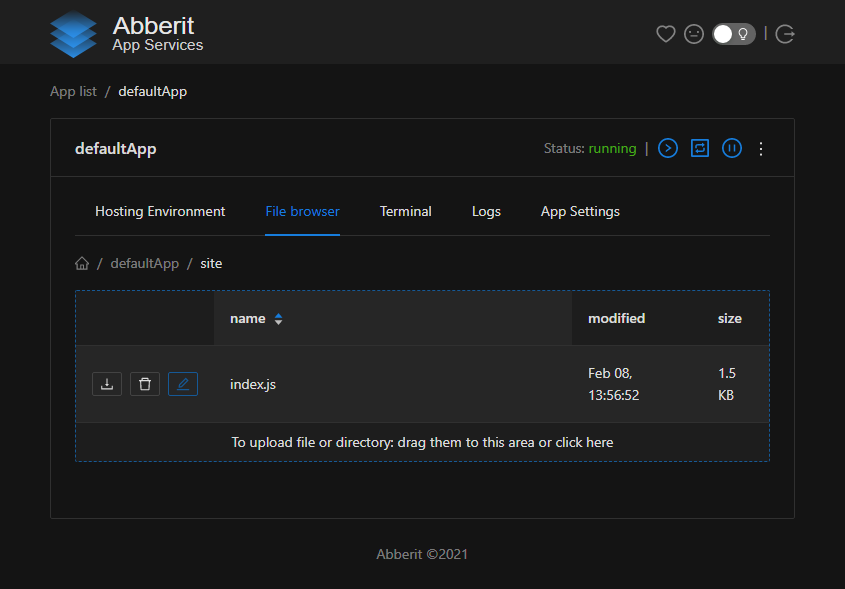
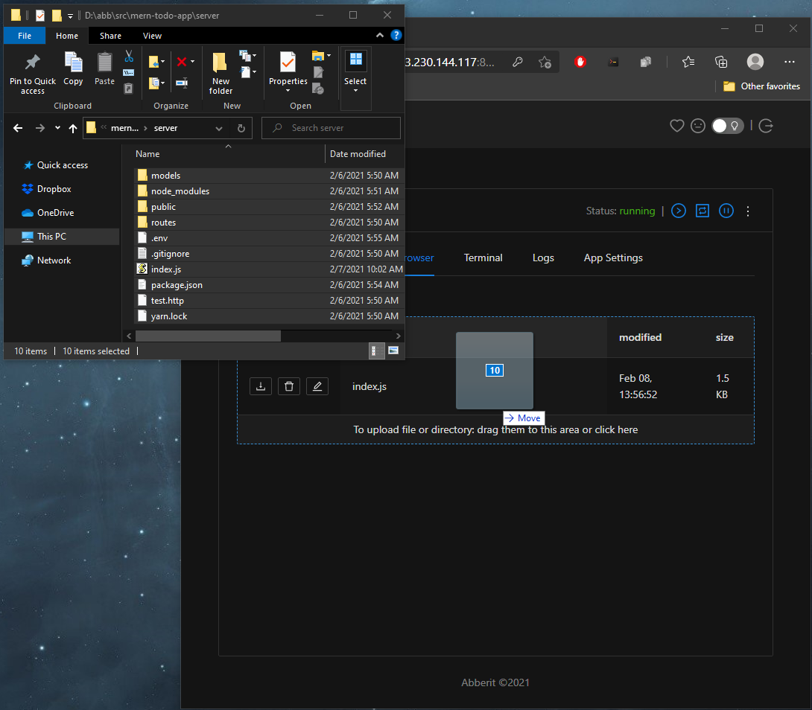
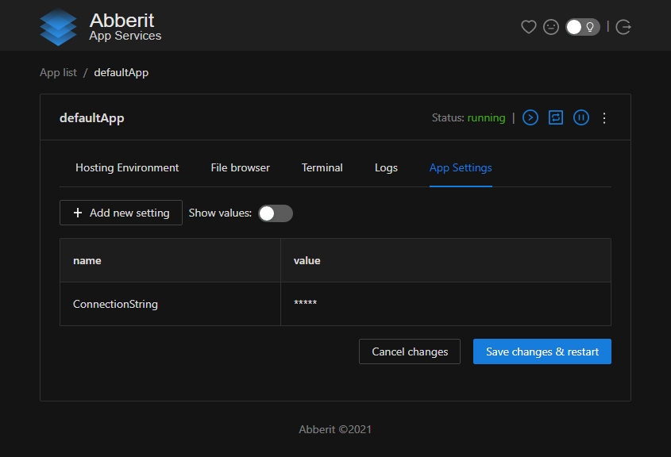
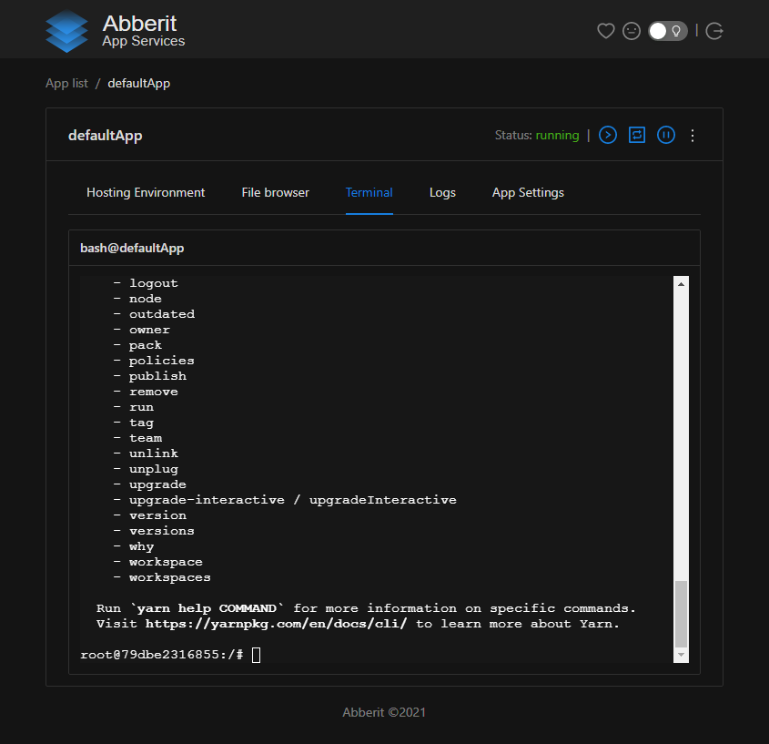

# Manage Node.js app

`File Browser` in Abberit Admin Panel allows to deploy new Node.js app and do quick edits on deployed scripts.
 
`App Settings` allow to add and change database connection string, environment variables and other settings.
 
`Terminal` allows to do sophisticate maintenance and configuration tasks.

## File Browser

File Browser can be accessed by clicking on `upgrade` link on `App list` view on the application card or by clicking on `File Browser` tab in `App details` view.

To edit files in place click on the pencil icon next to the file name:

To deploy new Node.js app version - navigate to `/ab/site` folder. Then drag and drop files over the folder content in File Browser:

## App Settings

App Settings can be accessed by clicking on `settings` link on `App list` view on the application card or by clicking on `App Settings` tab in `App details` view.

App Settings are accessible in runtime as environment variables and usually hold connection strings and other secrets or various application settings.

To add new setting: click the button `Add new setting`. To edit existing setting: click on its name in the list.

## Terminal

Application Terminal can be accessed by clicking on `Terminal` tab in `App Details` view. It is `bash` terminal to OS hosting your Node.js application. From it you can accesss `yarn` and other Node.js and Debian utilities.

## Next steps
1. [Configure domain name for your application](app-domain.md)
2. [Configure https:// access to your website](app-https.md)

## Additional Guides:
1. [:material-launch: SSL certificate guides](https://www.linode.com/docs/guides/security/ssl/){target=_blank}
2. [:material-launch: Installing certbot](https://www.linode.com/docs/guides/how-to-install-certbot-on-ubuntu-18-04/){target=_blank}