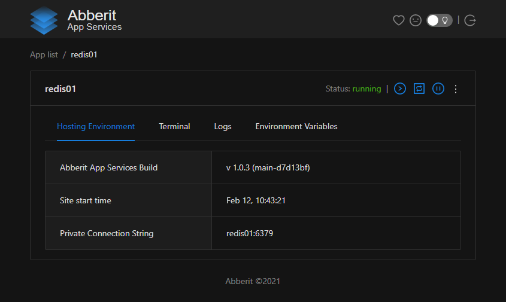
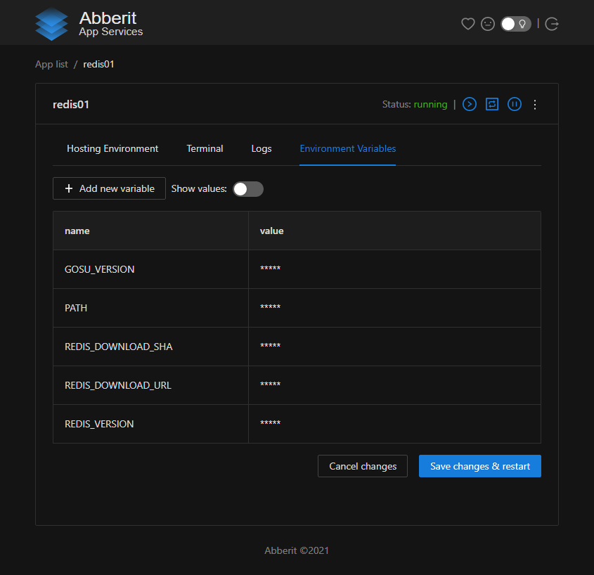
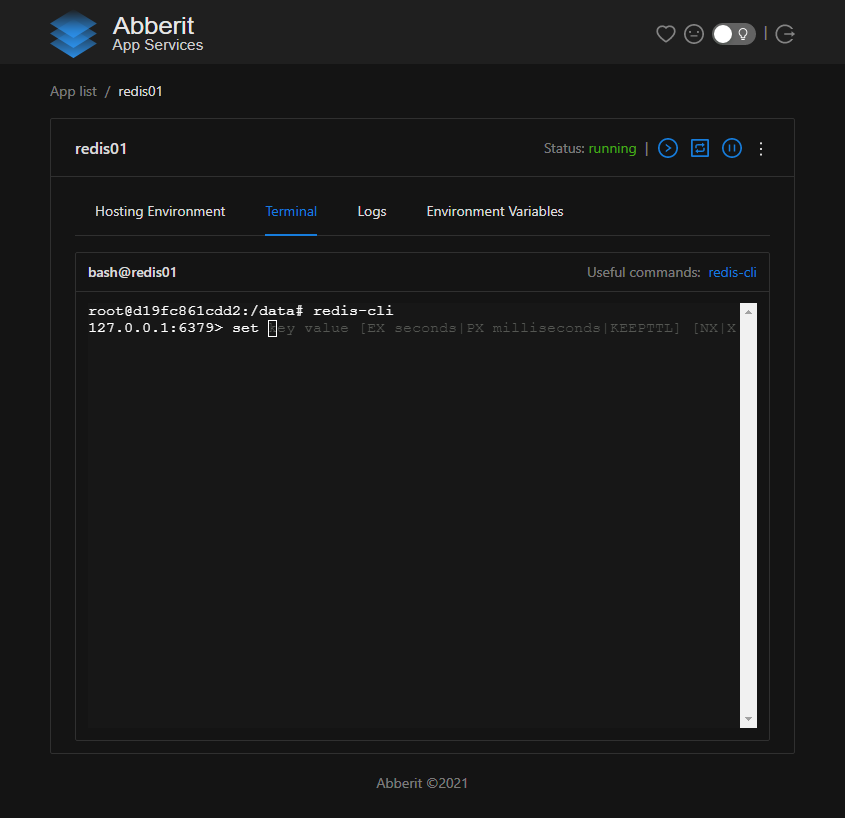

# Manage Redis

Abberit Admin Panel provide experiences which allow you to manage Redis.

`Hosting Environment` provides the information such as `Private Connection String` and `Public Connection String`.

`Environment Variables` allows to add and change database environment variables, most specifically `REDIS_PASSWORD` which sets up password for Redis authentication.
 
`Terminal` provides an access to Redis CLI and allows to do sophisticate maintenance and configuration tasks.

## Hosting Environment
`Hosting Environment` can be access by clicking on `Hosting Environment` tab on `App details` view.

It provides `Private Connection String`, which is recommended to be used for secure access by the applications running on the same server or cluster.

When public port was configured to access Redis outside of the server or cluster - then `Public Connection String` will be shared as well. That is strongly recommended to protect your database with username and password in that case and rotate them regularly.

## Environment Variables

`Environment Variables` can be accessed by clicking on `settings` link on `App list` view on the application card or by clicking on `Environment Variables` tab in `App details` view.

This tab allows to manage environment variables which define the behavior of MongoDB database.

## Terminal

`Terminal` can be accessed by clicking on `Terminal` tab in `App Details` view. It is `bash` terminal to OS hosting your Redis cache server. From it you can accesss `redis-cli` and other Redis and Debian utilities.

## Additional Guides:
1. [Redis CLI](https://redis.io/topics/rediscli){target=_blank}
