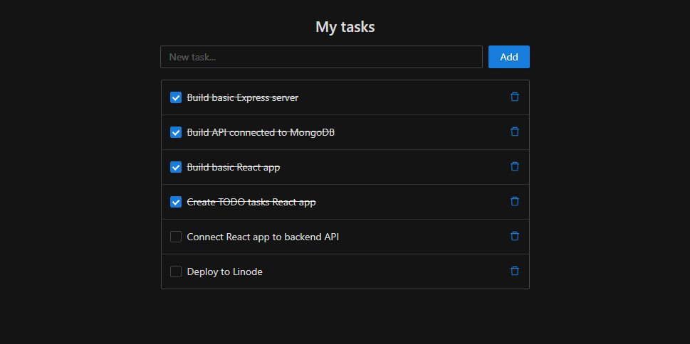

# Create Node.js app on Linode VM

This guide demonstrates how to create modern MERN (MongoDB, Express, React, Node.js) application on Linode.

At the end of tutorial you will have TODO web application hosted on Linode server alongside with MongoDB and Node backend.

To start go to [tutorial.md](https://github.com/Abberit/mern-todo-app/blob/master/tutorial.md){target=_blank}. Your will create web application which looks like this:

